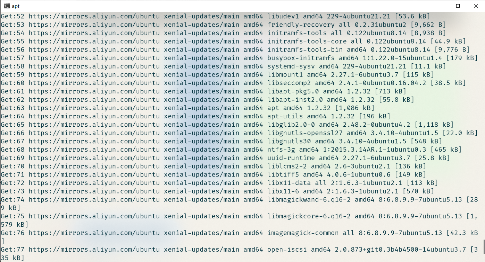
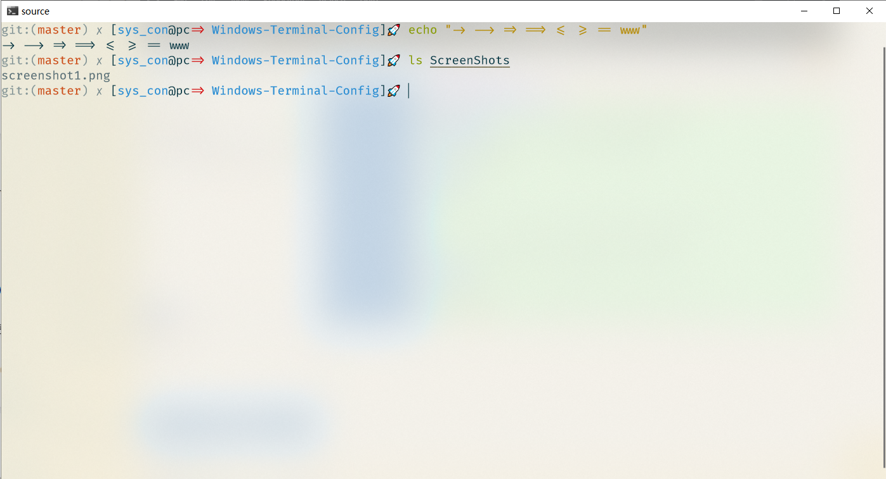

# 什么是 Windows Terminal Config
最新的 windows 终端 Windows Terminal 的个人配置以及 WSL 部分配置
# 配置有那些方面
+ Windows Terminal 的字体，亚克力模糊效果以及终端主题配置
+ WSL 的 zsh,PS1 配置
# 如何使用
1. 克隆源码
    ``` bash
    git clone https://github.com/SysConKonn/Windows-Terminal-Config
    ```
2. 将 `profiles.json` 内容替换 Windows Terminal 的配置文件内容
3. 使用 WSL ，安装 zsh ，将 `.zshrc` 替换 WSL 中的 `~/.zshrc`
# 配置截图



#  依赖关系

+ Fira Code 字体
+ Windows Terminal (Preview) 应用程序 with Windows 10 (version >= 1903)
+ WSL 子系统
